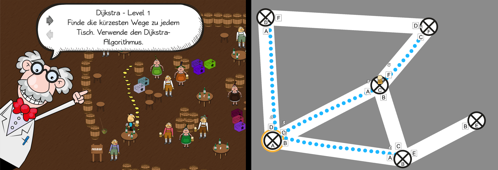

# Beer Routing - a different approach to teach routing algorithms.
Created by Jonas Kraus, Matthias Mak, Philipp Speidel, Fabian Widmann.
Advisors: Julian Frommel, Katja Rogers.

The game was developed in the WS15/16 term as one part of an individual project in the serious games (see more at the [media informatics department](https://www.uni-ulm.de/in/mi.html)) department.
___
# Goal
+ Create a working game
+ Teach the basics of several routing algorithms such as:
  + Dijkstra's algorithm
  + Greedy routing
  + Uniform Cost Search (to show the differences to Dijkstra's algorithm)
  + Policy based routing
+ Provide decent tutorials
___

# Comparison between both versions

___
Half a year later, the goal is to create two sub versions of this game, one containing the same comic look and one containing a more simulation style. Additionally instead of having all the levels unlocked we only use dijkstra for our study. Generally this game will then be used in a course at the Ulm University in WS16/17 and evaluated.
# Todo
- [x] provide logging options
    - Example Log:
    ```
    Username=xyz;	 Level= MaxScore=85, Type=Dijkstra	 current Time=2016-10-17T11:07:48
    2016-10-17T11:07:53: Valid Hop Discovery;	Player did perform a valid hop. destination=PathAC (PathScript);	Score% = 6
    2016-10-17T11:08:00: Valid Hop Discovery;	Player did perform a valid hop. destination=PathAD (PathScript);	Score% = 12
    2016-10-17T11:08:08: Valid Hop Discovery;	Player did perform a valid hop. destination=PathAB (PathScript);	Score% = 18
    2016-10-17T11:08:18: Valid Hop;	Player did perform a valid hop. destination=PathAC (PathScript);	Score% = 29
    2016-10-17T11:08:23: Valid Hop Discovery;	Player did perform a valid hop. destination=PathCB (PathScript);	Score% = 35
    2016-10-17T11:08:29: Valid Hop Discovery;	Player did perform a valid hop. destination=PathCF (PathScript);	Score% = 41
    2016-10-17T11:08:33: Valid Hop;	Player did perform a valid hop. destination=PathCB (PathScript);	Score% = 53
    2016-10-17T11:08:36: Valid Hop Discovery;	Player did perform a valid hop. destination=PathBE (PathScript);	Score% = 59
    2016-10-17T11:08:43: Valid Hop;	Player did perform a valid hop. destination=PathBE (PathScript);	Score% = 71
    2016-10-17T11:08:47: No Operation;	Player travels through completely handled destination=PathBE (PathScript);	Score% = 71
    2016-10-17T11:08:49: No Operation;	Player travels through completely handled destination=PathBA (PathScript);	Score% = 71
    2016-10-17T11:08:55: Wrong Hop;	Player did perform a wrong hop. destination=PathAD (PathScript);	Score% = 47
    2016-10-17T11:09:02: Error Recovery;	Recovered from Error, ErrorRecoveryStatus=ERROR_RECOVERED;	Score% = 47
    2016-10-17T11:09:06: No Operation;	Player travels through completely handled destination=PathAC (PathScript);	Score% = 47
    2016-10-17T11:09:28: Valid Hop;	Player did perform a valid hop. destination=PathCF (PathScript);	Score% = 59
    2016-10-17T11:09:32: Valid Hop Discovery;	Player did perform a valid hop. destination=PathFD (PathScript);	Score% = 65
    2016-10-17T11:09:43: Valid Hop;	Player did perform a valid hop. destination=PathFD (PathScript);	Score% = 76
    2016-10-17T11:09:49: Level Finished; Player has finished the level;	Score% = 76
    2016-10-17T11:09:49: Summary; Printing the Summary of stats for this run:
    2016-10-17T11:09:49:
    2016-10-17T11:09:49: Buttons; Professor Button clicks= 1
    2016-10-17T11:09:49: Buttons; Routing Table Button clicks=1
    2016-10-17T11:09:49: Count; #Error Recovery= 0
    2016-10-17T11:09:49: Count; #NOPs = 3
    2016-10-17T11:09:49: Count; #Wrong Hops= 1
    2016-10-17T11:09:49: Count; #UndiscoveredPaths= 0
    ```
- [ ] Provide a means to send the log files
    - [ ] Uni email?
    - [ ] FTP?
- [x] Add an option to enter a nickname to eventually link students to their points
- [x] Alternate art version for the "simulation" style
  - [x] Adapted texts
  - [x] Adapted GUI
  - [x] Adapt Sequences for the Tutorial
  - [ ] Fix a bug in the level, where the wrong font is displayed in the *level finished* dialogue
  - [ ] Check the position of the scoretexts
- [ ] What needs to be logged?
  - [x] Logging for routingtable and professor buttons
  - [x] Logging for NOPs, errors, undiscovered neighbours etc.
  - ... ?
- [ ] Find questions for the survey
- [ ] Limesurvey version of the questionnaire
- [ ] Homepage
  - [ ] Generate code for students that completed the study
  - [ ] Check status of individuals
  - [ ] Display informations for Studends

- [ ] New Levels (2 comic, 2 simulation, eventually even 2 more for paper exercises)
- ...

___
Runs fine on Unity 5.3.4f1 - in newer versions movement seems to be broken without a cause.
